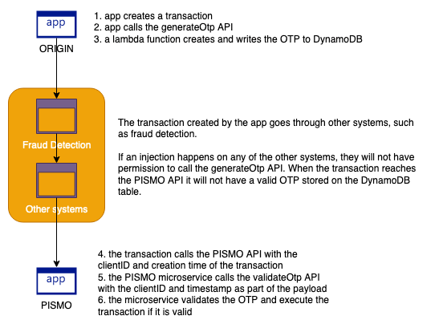

# One Time Passcode solution

## Description
This solution implements a simple One Time Passcode (OTP) solution using AWS serverless services. It will allow systems to use a fast solution that creates a secure OTP and use it to validate transactions programatically. It is a cost effective solution when compared to HW-based solutions or proprietary 3rd party solutions.

## Challenge to be solved and approach taken
The problem we are trying to solve is to add an additional layer of security when processing financial transactions. The transaction is originated on a client application and passes through many other systems before it reaches the PISMO backend API. Those systems are managed by other participants and are out of control of the PISMO solution. The idea is to generate an OTP on the client application which writes to a database reached only by the client application and the PISMO microservice. The intermediate systems will not have access to this database. The client application sends, along with the transaction, its own client ID and timestamp of the transaction. The timestamp is going to be used as a Time-To-Live parameter on the database so the OTP will be valid for only a short period of time. The client ID and timestamp are going to be used by the PISMO microservice to find the OTP for the transaction and validate it.

To implement this solution we are using an Amazon API Gateway to expose the microservice that will create the OTP. The AWS Lambda function that acts as the integration requests uses a simple UUID_V4 to generate a hash that will act as the OTP. Then AWS KMS uses a CMK to encrypt the OTP hash and stores it into a DynamoDB table. The client application then receives the timestamp and encrypted OTP and sends them along with its client ID to the transaction workflow. This metadata will passthrough the intermediate systems and reach the PISMO microservice. Once the microservice receives this metadata it can use it to query the DynamoDB table. In order to validate the OTP, the microservice can: 1/ decrypt the encrypted OTP, 2/ check if the unencrypted OTP matches, and 3/ validate that the context used to encrypt the OTP remains the same. 

Using a context to encrypt your data is a powerful way to add additional checks. The context can contain a lot of information. On this example, there is a stage, purpose, and client ID fields. You could have a region field with the region where the transaction originated. To fake a transaction, not only the perpetrator needs to have a valid OTP but also a valid context. Context can be an information hard coded into an application only known by the PISMO microservice. It can be an encrypted string as well, something that PISMO generates internally and provides it already encrypted to the client application. 

I am using a TTL to delete OTP after 1-minute. DynamoDB does not guarantee the imediate deletion of items with an expired TTL. It might take up to 48 hours. If you require, please implement a `FilterExpression` on the `GetItemCommand` to filter out items with an expired TTL. You can do so by using the `timestamp` provided on the queryString and check if more than a minute has passed. The TTL is hardcoded as 1 minute on the lambda function. It could be a lambda environment variable.

## Installation
To implement this solution you need to clone this repository and then run `npm install` from the top directory. Make sure you `cd src/` and also run `npm install` before you deploy the solution. We are using CDK, so you need to bootstrap CDK by running `npx cdk bootstrap aws://<accountID>/<region>` before you can run `npx cdk deploy` to implement the solution on the desired account and region.

## Usage
You can use either Postman or `curl` to test the solution. 

To test the flow of creating the OTP, make sure you call the `generateOtp` API using the endpoint created during the deploy. Pass as a queryString a parameter named `clientId`. It can be anything. I've tested it using a four digit number such as `1234`. You should get back the timestamp of the transaction plus the encrypted OTP. 

To test the flow of validating the OTP, make sure you call the `validateOtp` API using the endpoint created during the deploy. Pass as a queryString two parameters named `clientId` and `timestamp`. You should receive a message, the TTL (which you will see it is 1 minute later than the timestamp) and the unecrypted OTP.

# Support
If you need help with this, please find me on Slack. Do not email me. My alias: paragao.

# Roadmap
Nothing on the roadmap so far.

# Contributing
If you want to contribute to this project, feel free to do so. Please bear in mind that this is an open source project so avoid proprietary libraries and/or code. 

# Authors and acknowledgment
This solution was created by Paulo Aragão (paragao@amazon.com) based on a customer requirement.

# License
Apache License 2.0